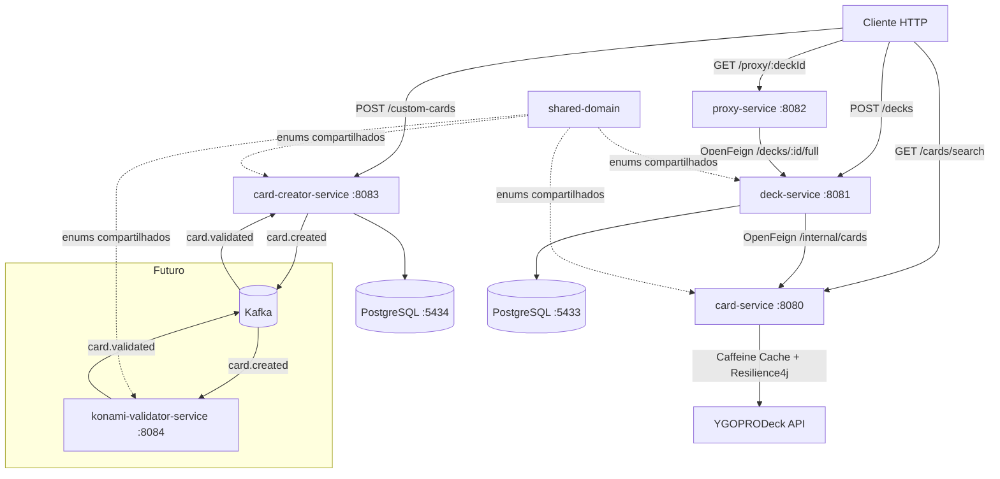
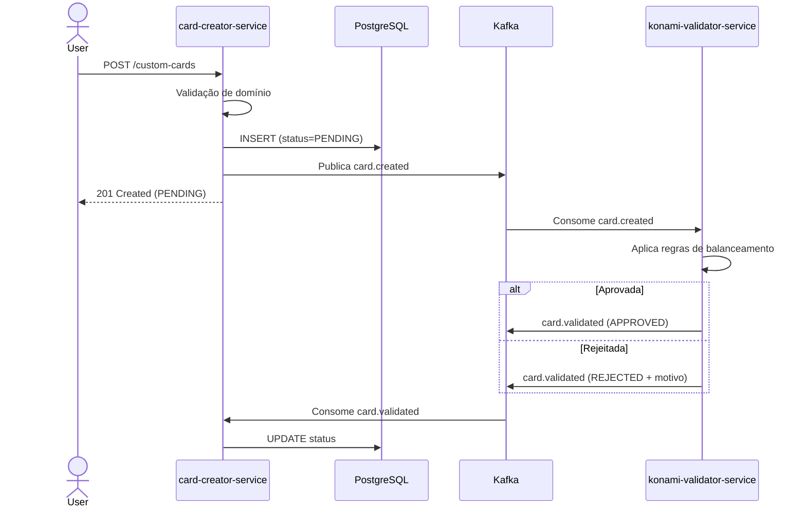

# Yu-Gi-Oh! Deck Management

Sistema de gerenciamento de coleções e decks de cartas Yu-Gi-Oh!, construído com arquitetura hexagonal em microserviços independentes que se comunicam via OpenFeign e Kafka.


---

## Visão Geral

O sistema é dividido em microserviços com responsabilidades bem delimitadas, organizados como monorepo Gradle. Até o momento esses são os microserviços existentes:

| Serviço | Porta | Responsabilidade |
|---------|-------|-----------------|
| **card-service** | 8080 | Consulta ao catálogo de cartas via YGOPRODeck API com cache |
| **deck-service** | 8081 | Criação e composição de decks (Main, Extra e Side) |
| **card-creator-service** | 8083 | Criação de cartas customizadas com validação assíncrona |
| **proxy-service** | 8082 | Geração de PDFs de cartas para impressão de proxies |
| **shared-domain** | — | Biblioteca interna com enums compartilhados entre os serviços |

---

## Arquitetura

O projeto segue a **Arquitetura Hexagonal (Ports & Adapters)**, isolando completamente o domínio de negócio de frameworks e infraestrutura. Cada serviço é estruturado em três camadas:

```
adapter/in/rest      ← Controllers (entrada HTTP)
application/service  ← Use Cases (orquestração)
domain/model         ← Entidades e Ports (núcleo isolado)
adapter/out/         ← Persistência, Feign, Kafka, API externa (saída)
```

### Diagrama de Comunicação



### Fluxo de Criação de Carta Customizada



---

## Shared Domain

O `shared-domain` é um módulo Java puro — sem Spring, sem banco, sem dependências externas — que contém os enums que representam o vocabulário do universo Yu-Gi-Oh!. Ele existe porque múltiplos serviços precisam falar a mesma língua, garantindo consistência sem duplicação de código e sem criar acoplamento de runtime entre os serviços.

| Enum | Valores |
|------|---------|
| `CardType` | MONSTER, SPELL, TRAP |
| `MonsterAttribute` | DARK, LIGHT, FIRE, WATER, EARTH, WIND, DIVINE |
| `MonsterType` | DRAGON, WARRIOR, SPELLCASTER, FIEND e outros 19 tipos |
| `MonsterSubType` | NORMAL, EFFECT, FUSION, SYNCHRO, XYZ, LINK e outros |
| `SpellType` | NORMAL, CONTINUOUS, QUICK_PLAY, FIELD, EQUIP, RITUAL |
| `TrapType` | NORMAL, CONTINUOUS, COUNTER |

---

## Stack

| Camada | Tecnologia |
|--------|-----------|
| Linguagem | Java 17 |
| Framework | Spring Boot 3.1.9 |
| Build | Gradle 7.5 (monorepo multi-módulo) |
| Comunicação entre serviços | Spring Cloud OpenFeign |
| Mensageria | Apache Kafka |
| Resiliência | Resilience4j (CircuitBreaker + Retry) |
| Cache | Caffeine (Spring Cache) |
| Persistência | Spring Data JPA + Flyway |
| Banco de dados | PostgreSQL |
| Geração de PDF | OpenPDF |
| Mapeamento | Lombok |
| Containers | Docker + Docker Compose |
| CI | GitHub Actions |

---

## Como Executar

### Pré-requisitos

- Java 17+
- Docker e Docker Compose

### Subir a infraestrutura

```bash
docker compose up -d
```

Isso sobe o PostgreSQL (deck-service na porta 5433, card-creator-service na porta 5434), Zookeeper e Kafka.

### Buildar o projeto

```bash
./gradlew :shared-domain:build
./gradlew :card-service:bootRun
./gradlew :deck-service:bootRun
./gradlew :card-creator-service:bootRun
./gradlew :proxy-service:bootRun
```

---

## Endpoints Principais

### card-service (8080)

| Método | Endpoint | Descrição |
|--------|----------|-----------|
| `GET` | `/cards/search?name=&fname=&type=&page=&size=` | Busca cartas com filtros via YGOPRODeck |
| `GET` | `/internal/cards/{id}` | Busca carta por ID (uso interno) |
| `GET` | `/internal/cards?ids=` | Busca múltiplas cartas por IDs (uso interno) |

### deck-service (8081)

| Método | Endpoint | Descrição |
|--------|----------|-----------|
| `POST` | `/decks` | Cria um novo deck |
| `GET` | `/decks` | Lista decks do usuário |
| `GET` | `/decks/{deckId}` | Busca deck por ID |
| `GET` | `/decks/{deckId}/full` | Retorna deck com dados completos das cartas |
| `POST` | `/decks/{deckId}/cards` | Adiciona carta ao deck |
| `DELETE` | `/decks/{deckId}/cards` | Remove carta do deck |
| `DELETE` | `/decks/{deckId}` | Remove deck |

### card-creator-service (8083)

| Método | Endpoint | Descrição |
|--------|----------|-----------|
| `POST` | `/custom-cards` | Cria carta customizada (requer header `X-User-Id`) |
| `GET` | `/custom-cards/{id}` | Consulta carta e status de validação |
| `GET` | `/custom-cards` | Lista cartas do usuário (requer header `X-User-Id`) |

### proxy-service (8082)

| Método | Endpoint | Descrição |
|--------|----------|-----------|
| `GET` | `/proxy/{deckId}` | Gera PDF com imagens das cartas do deck para impressão |

---

## Regras de Criação de Cartas Customizadas

As validações vivem no domínio — é impossível criar uma `CustomCard` inválida independente de onde for instanciada.

- ATK e DEF entre 0 e 5000
- Level entre 1 e 12
- Nome máximo de 255 caracteres
- Descrição/efeito máximo de 2000 caracteres
- Atributo, tipo e subtipo obrigatórios conforme o tipo da carta

---

## Próximos Passos

- [ ] konami-validator-service — validação de balanceamento de cartas customizadas via Kafka
- [ ] community-service — grupos de duelo, geolocalização de jogadores e troca de cartas
- [ ] WebSocket — notificações em tempo real
- [ ] Elasticsearch — busca full-text de cartas por efeito/descrição
- [ ] Validação de regras de deck (40-60 main, máximo 15 extra/side, máximo 3 cópias)
- [ ] Testes unitários e de integração com Testcontainers

---

## Autor

**Pedro (odevpedro)**
[GitHub](https://github.com/odevpedro) · [dev.to](https://dev.to/odevpedro) · [Blog](http://odevpedro.bearblog.dev)
