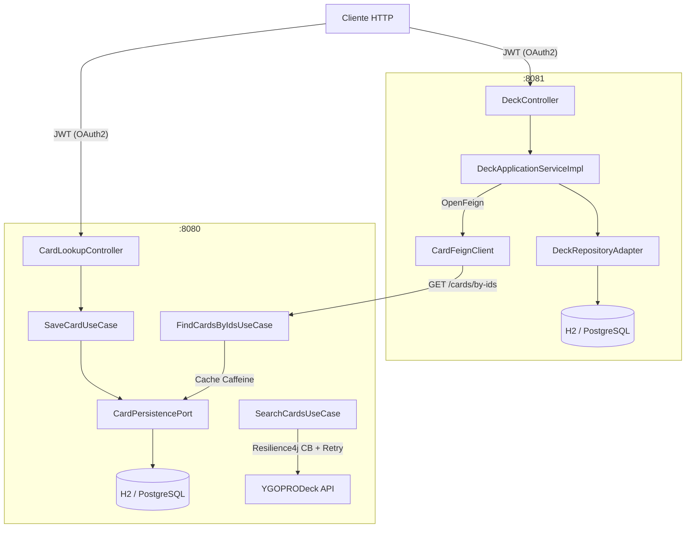
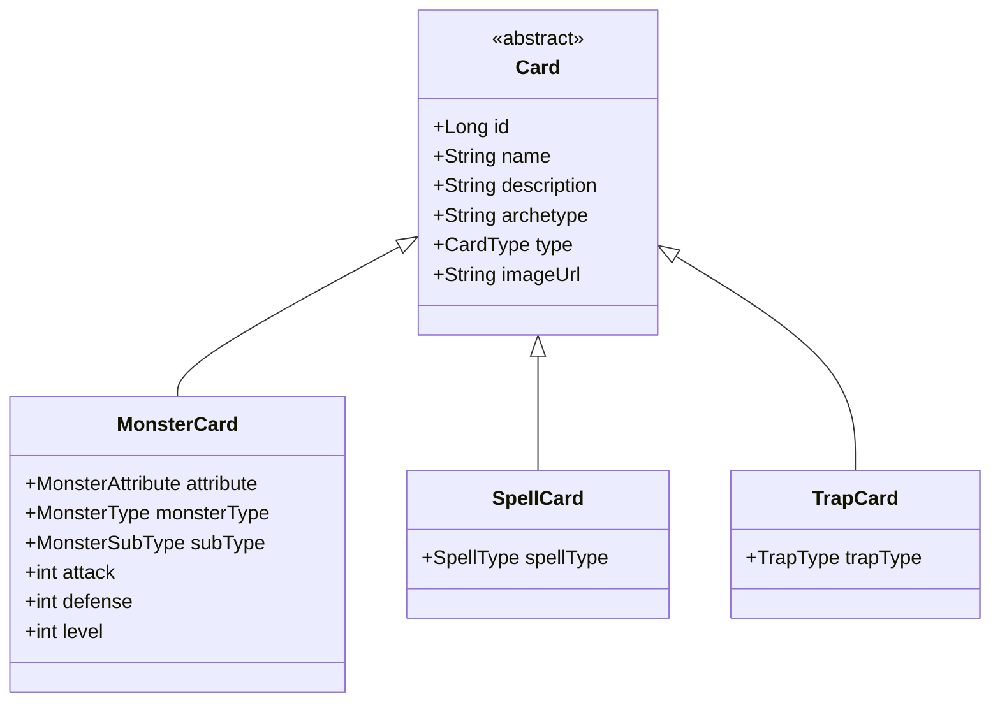
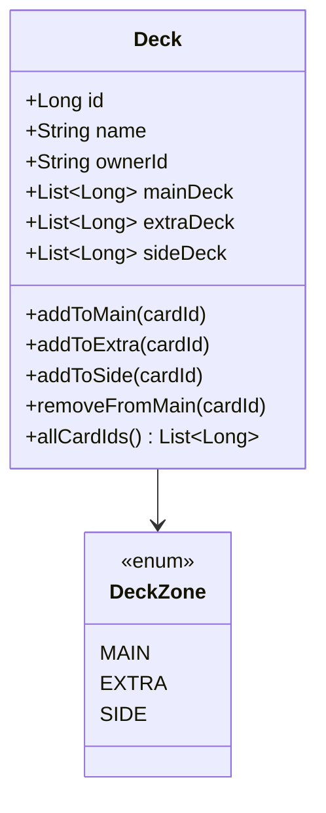

# Yu-Gi-Oh! Deck Management

Sistema de gerenciamento de coleções e decks de cartas Yu-Gi-Oh!, construído com arquitetura hexagonal em dois microserviços independentes que se comunicam via OpenFeign.


---

## Visão Geral

O sistema é dividido em dois serviços com responsabilidades bem delimitadas:

- **card-service** — gerencia o catálogo de cartas (Monster, Spell e Trap), coleções de usuários e integração com a API externa [YGOPRODeck](https://ygoprodeck.com/api-guide/)
- **deck-service** — gerencia criação e composição de decks (Main, Extra e Side), consultando o `card-service` via Feign para enriquecer os dados das cartas

---

## Arquitetura

O projeto segue a **Arquitetura Hexagonal (Ports & Adapters)**, isolando completamente o domínio de negócio de frameworks e infraestrutura. Cada serviço é estruturado em três camadas:

```
adapter/in/rest      ← Controllers (entrada HTTP)
application/service  ← Use Cases (orquestração)
domain/model         ← Entidades e Ports (núcleo isolado)
adapter/out/         ← Persistência, Feign, API externa (saída)
```

### Diagrama de Comunicação



### Modelo de Domínio — Cartas



### Modelo de Domínio — Deck



---

## Decisões de Design

**Por que Arquitetura Hexagonal?**
O domínio de cartas e decks possui regras de negócio complexas (validação de tipos de carta por zona, limites de quantidade) que não devem depender de frameworks. Com a hexagonal, os Use Cases são testáveis de forma unitária sem Spring, sem banco e sem mocks pesados — basta injetar implementações de teste dos ports.

**Por que dois serviços separados?**
`card-service` e `deck-service` têm ciclos de vida e escalabilidade diferentes. O catálogo de cartas é lido com muito mais frequência do que decks são modificados, o que permite aplicar cache (Caffeine) de forma independente e escalar os serviços separadamente.

**Por que Resilience4j no card-service?**
A integração com a API YGOPRODeck é um ponto de falha externo. O Circuit Breaker (`ygopro`) evita cascata de falhas quando a API está instável, e o Retry com backoff lida com falhas transitórias de rede (configurado para `SocketTimeoutException` e `IOException`).

**Por que Flyway?**
O histórico de schema está versionado em SQL (`V1__` até `V5__` no card-service, `V1__` até `V4__` no deck-service), garantindo que qualquer ambiente suba com o banco no estado correto e que a evolução do schema seja rastreável no histórico do Git.

---

## Stack

| Camada | Tecnologia |
|--------|-----------|
| Linguagem | Java 17 |
| Framework | Spring Boot 3.1.9 |
| Build | Gradle 7.5 |
| Comunicação entre serviços | Spring Cloud OpenFeign |
| Resiliência | Resilience4j (CircuitBreaker + Retry) |
| Cache | Caffeine (Spring Cache) |
| Persistência | Spring Data JPA + Flyway |
| Banco de dados | H2 (dev) |
| Autenticação | Spring Security OAuth2 Resource Server (JWT) |
| Mapeamento | Lombok |

---

## Estrutura do Projeto

```
yu-gi-oh-deck-management/
├── card-service/
│   ├── src/main/java/.../
│   │   ├── adapter/in/rest/          # Controllers (CardLookupController, CollectionController...)
│   │   ├── adapter/out/
│   │   │   ├── external/             # YgoProFeignClient + YgoProApiClient
│   │   │   └── persistance/          # Adapters JPA, Repositories, Entities
│   │   ├── application/
│   │   │   ├── service/              # Use Cases (SaveCardUseCase, SearchCardsUseCase...)
│   │   │   └── config/               # CacheConfig, Helpers
│   │   └── domain/model/
│   │       ├── Card.java (abstract)
│   │       ├── MonsterCard.java
│   │       ├── SpellCard.java
│   │       ├── TrapCard.java
│   │       ├── enums/                # CardType, MonsterAttribute, SpellType...
│   │       └── ports/                # CardPersistencePort, ExternalCardQueryPort...
│   └── src/main/resources/
│       ├── application.yml
│       └── db/migration/             # V1 a V5
│
└── deck-service/
    ├── src/main/java/.../
    │   ├── adapter/in/rest/          # DeckController
    │   ├── adapter/out/
    │   │   ├── external/             # CardFeignClient, DTOs
    │   │   └── persistence/          # DeckRepositoryAdapter, Entities
    │   ├── application/
    │   │   ├── service/              # DeckApplicationServiceImpl, FindDeckByIdUseCase...
    │   │   └── mapper/               # DeckMapper
    │   └── domain/model/
    │       ├── Deck.java
    │       ├── DeckZone.java
    │       └── port/                 # DeckRepositoryPort
    └── src/main/resources/
        ├── application.yml
        └── db/migration/             # V1 a V4
```

---

## Como Executar

### Pré-requisitos

- Java 17+
- Gradle 7.5+ (ou use o wrapper `./gradlew`)

### card-service (porta 8080)

```bash
cd card-service
./gradlew bootRun
```

### deck-service (porta 8081)

```bash
cd deck-service
./gradlew bootRun
```

> Ambos os serviços sobem com H2 em memória por padrão. Nenhuma configuração adicional é necessária para rodar localmente.

---

## Endpoints Principais

### card-service

| Método | Endpoint | Descrição |
|--------|----------|-----------|
| `POST` | `/cards` | Cadastra uma carta no catálogo |
| `GET` | `/cards/{id}` | Busca carta por ID |
| `GET` | `/cards/search?name=...` | Busca carta na API YGOPRODeck |
| `POST` | `/collections` | Adiciona carta à coleção do usuário |
| `GET` | `/collections` | Lista coleção do usuário |
| `DELETE` | `/collections/{id}` | Remove carta da coleção |

### deck-service

| Método | Endpoint | Descrição |
|--------|----------|-----------|
| `POST` | `/decks` | Cria um novo deck |
| `GET` | `/decks` | Lista decks do usuário autenticado |
| `GET` | `/decks/{deckId}` | Busca deck por ID |
| `POST` | `/decks/{deckId}/cards` | Adiciona carta ao deck |
| `GET` | `/decks/{deckId}/full` | Retorna deck com dados completos das cartas (via Feign) |

---

## Configuração de Resiliência (card-service)

O acesso à API YGOPRODeck é protegido por Circuit Breaker e Retry:

```yaml
resilience4j:
  circuitbreaker:
    instances:
      ygopro:
        slidingWindowSize: 10
        failureRateThreshold: 50      # abre o circuito com 50% de falhas
        waitDurationInOpenState: 10s
        minimumNumberOfCalls: 6
  retry:
    instances:
      ygopro:
        maxAttempts: 3
        waitDuration: 250ms
        retryExceptions:
          - feign.RetryableException
          - java.net.SocketTimeoutException
          - java.io.IOException
```

---

## Próximos Passos

- [ ] Adicionar testes unitários nos Use Cases com JUnit 5 + Mockito
- [ ] Adicionar testes de integração com Testcontainers
- [ ] Configurar Docker Compose para subir os dois serviços + bancos com um comando
- [ ] Adicionar pipeline CI/CD com GitHub Actions
- [ ] Implementar validação de regras de deck (limite de 60 cartas no main, 15 no extra/side)
- [ ] Substituir H2 por PostgreSQL no perfil de produção

---

## Autor

**Pedro (odevpedro)**
[GitHub](https://github.com/odevpedro) · [dev.to](https://dev.to/odevpedro) · [Blog](http://odevpedro.bearblog.dev)
