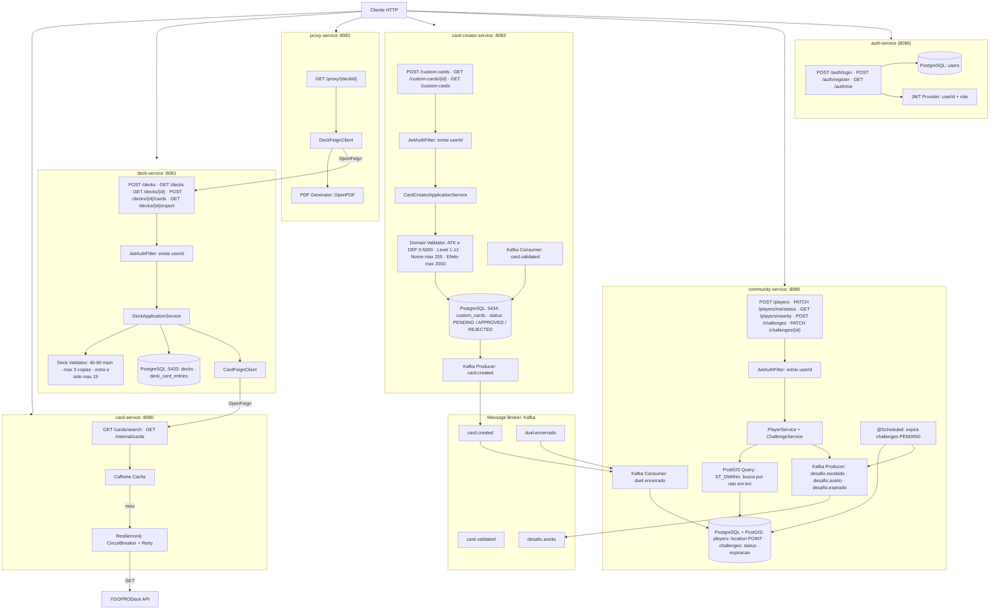

# Yu-Gi-Oh! Deck Management

Sistema de gerenciamento de colecoes e decks de cartas Yu-Gi-Oh!, construdo com arquitetura hexagonal em microservicos independentes que se comunicam via OpenFeign e Kafka.

[](https://www.oracle.com/java/)
[](https://spring.io/projects/spring-boot)
[](https://alistair.cockburn.us/hexagonal-architecture/)
[](https://kafka.apache.org/)
[](https://www.postgresql.org/)
[](https://postgis.net/)

---

## Sobre o Projeto

API REST para gerenciamento de decks de cartas Yu-Gi-Oh! com funcionalidades de busca de cartas oficiais via YGOPRODeck API, criacao de cartas customizadas, geracao de PDFs para proxies e sistema de comunidade para encontrar jogadores cercanos e desafiar para duelos.

---

## Stack & Arquitetura

| Camada | Tecnologia |
|--------|------------|
| Runtime | Java 17 |
| Framework | Spring Boot 3.2 |
| Build | Gradle 7.5 (monorepo multi-modulo) |
| Comunicacao entre servicos | Spring Cloud OpenFeign |
| Mensageria | Apache Kafka |
| Resiliencia | Resilience4j (CircuitBreaker + Retry) |
| Cache | Caffeine (Spring Cache) |
| Persistencia | Spring Data JPA + Flyway |
| Banco de dados | PostgreSQL |
| Geolocalizacao | PostGIS (ST_DWithin) |
| Geracao de PDF | OpenPDF |
| Seguranca | Spring Security + JWT |
| Mapeamento | Lombok |
| Containers | Docker + Docker Compose |

> Padrao arquitetural: **Hexagonal (Ports & Adapters)** com separacao em camadas `adapter/in/rest → application/service → domain/model → adapter/out/`.

---

## Estrutura de Pastas

```
yu-gi-oh-deck-management/
├── shared-domain/               # Biblioteca interna com enums e constantes
│   └── src/main/java/
│       └── com/odevpedro/yugiohcollections/shared/
│           ├── constants/       # ApiRoutes - centralizacao de rotas
│           ├── domain/         # Enums: CardType, MonsterAttribute, etc
│           └── config/         # JwtAuthFilter
├── auth-service/                # Autenticacao e emissao de JWT
│   └── src/main/java/
│       └── com/odevpedro/yugiohcollections/auth/
│           ├── adapter/in/rest/ # AuthController
│           ├── application/    # AuthService
│           └── domain/         # User entity
├── card-service/                # Consulta ao catalogo de cartas
│   └── src/main/java/
│       └── com/odevpedro/yugiohcollections/card/
│           ├── adapter/in/rest/ # CardController
│           ├── application/    # SearchCardsUseCase
│           ├── domain/        # Card entity
│           └── adapter/out/   # ExternalCardQueryPort
├── deck-service/                # Gerenciamento de decks
│   └── src/main/java/
│       └── com/odevpedro/yugiohcollections/deck/
│           ├── adapter/in/rest/ # DeckController
│           ├── application/    # DeckApplicationService
│           ├── domain/        # Deck, DeckCardEntry
│           └── adapter/out/   # DeckRepository, CardFeignClient
├── card-creator-service/        # Criacao de cartas customizadas
│   └── src/main/java/
│       └── com/odevpedro/yugiohcollections/creator/
│           ├── adapter/in/rest/ # CustomCardController
│           ├── application/    # CustomCardService
│           └── domain/        # CustomCard entity
├── proxy-service/               # Geracao de PDF para proxies
│   └── src/main/java/
│       └── com/odevpedro/yugiohcollections/proxy/
│           ├── adapter/in/rest/ # ProxyController
│           └── application/    # ProxyPdfService
├── community-service/            # Comunidade e desafios
│   └── src/main/java/
│       └── com/odevpedro/yugiohcollections/community/
│           ├── adapter/in/rest/ # PlayerController, ChallengeController
│           ├── application/    # PlayerService, ChallengeService
│           └── domain/        # Player, Challenge, DuelStatus
├── docs/
│   └── system-feature-flows.md  # Fluxos internos de cada feature
└── docker-compose.yml           # Infraestrutura

docs/
├── architecture.md
├── system-feature-flows.md
└── adr/
```

Cada servico segue a estrutura hexagonal:

```
adapter/in/rest      # Controllers (entrada HTTP)
application/service  # Use Cases (orquestracao)
domain/model         # Entidades e Ports (nucleo isolado)
adapter/out/         # Persistencia, Feign, Kafka, API externa (saida)
```

---

## Como Rodar Localmente

### Opção 1: Scripts Automatizados (Recomendado)

```bash
# 1. Clone o repositorio
git clone https://github.com/odevpedro/yu-gi-oh-deck-management.git && cd yu-gi-oh-deck-management

# 2. Inicia tudo (infra + servicos)
./run.sh start

# 3. Testa a API automaticamente (opcional)
./test-api.sh

# 4. Para todos os servicos
./run.sh stop
```

Comandos do `./run.sh`:
| Comando | Descricao |
|---------|-----------|
| `./run.sh start` | Sobe infraestrutura + todos os servicos |
| `./run.sh status` | Mostra status dos servicos |
| `./run.sh logs` | Mostra logs de todos os servicos |
| `./run.sh stop` | Para todos os servicos |
| `./run.sh restart` | Reinicia todos os servicos |
| `./run.sh infra` | Sobe apenas infraestrutura (Docker) |
| `./run.sh clean` | Para servicos e remove logs |

### Opção 2: Manual

```bash
# 1. Suba a infraestrutura
docker compose up -d

# 2. Build o projeto
./gradlew build

# 3. Inicie os servicos desejados (em terminais separados)
./gradlew :card-service:bootRun
./gradlew :deck-service:bootRun
./gradlew :auth-service:bootRun
./gradlew :card-creator-service:bootRun
./gradlew :proxy-service:bootRun
./gradlew :community-service:bootRun
```

---

## Testes

```bash
# Todos os testes
./gradlew test

# Apenas um servico especifico
./gradlew :deck-service:test

# Com cobertura
./gradlew test jacocoTestReport
```

---

## API — Endpoints Principais

Todas as rotas sao centralizadas em `ApiRoutes` (shared-domain).

### auth-service (8086)

| Metodo | Rota | Descricao | Auth |
|--------|------|-----------|------|
| POST | `/auth/register` | Registro de novo usuario | |
| POST | `/auth/login` | Autenticacao e geracao de tokens | |
| POST | `/auth/refresh` | Renovacao de access token via refresh token | |
| POST | `/auth/logout` | Revogacao de tokens (logout) | Bearer |
| GET | `/auth/me` | Retorna dados do usuario logado | Bearer |

### card-service (8080)

| Metodo | Rota | Descricao | Auth |
|--------|------|-----------|------|
| GET | `/cards` | Busca cartas com filtros (name, fname, type) | |
| GET | `/cards/internal/{id}` | Busca carta por ID (uso interno) | Bearer |
| GET | `/cards/internal?ids=` | Busca multiplas cartas por IDs | Bearer |

### deck-service (8081)

| Metodo | Rota | Descricao | Auth |
|--------|------|-----------|------|
| POST | `/decks` | Cria um novo deck | Bearer |
| GET | `/decks` | Lista decks do usuario | Bearer |
| GET | `/decks/{deckId}` | Busca deck por ID | Bearer |
| GET | `/decks/{deckId}/full` | Retorna deck com dados completos das cartas + validacao | Bearer |
| POST | `/decks/{deckId}/cards` | Adiciona carta ao deck (com validacao) | Bearer |
| DELETE | `/decks/{deckId}/cards` | Remove carta do deck | Bearer |
| DELETE | `/decks/{deckId}` | Remove deck | Bearer |
| GET | `/decks/{deckId}/export` | Exporta deck no formato `.ydk` | Bearer |

**Regras de Deck (Yu-Gi-Oh!):**
- Main Deck: 40-60 cartas
- Extra Deck: max 15 cartas
- Side Deck: max 15 cartas
- Max 3 copias de cada carta

### card-creator-service (8083)

| Metodo | Rota | Descricao | Auth |
|--------|------|-----------|------|
| POST | `/custom-cards` | Cria carta customizada | Bearer |
| GET | `/custom-cards/{id}` | Consulta carta e status de validacao | Bearer |
| GET | `/custom-cards` | Lista cartas do usuario | Bearer |

### proxy-service (8082)

| Metodo | Rota | Descricao | Auth |
|--------|------|-----------|------|
| GET | `/proxy/{deckId}` | Gera PDF com imagens das cartas para impressao | Bearer |

### community-service (8085)

| Metodo | Rota | Descricao | Auth |
|--------|------|-----------|------|
| POST | `/players` | Registra ou atualiza perfil e localizacao | Bearer |
| PATCH | `/players/me/status` | Atualiza disponibilidade para duelo | Bearer |
| GET | `/players/nearby` | Jogadores proximos com filtro de status | Bearer |
| POST | `/challenges` | Envia desafio de duelo | Bearer |
| PATCH | `/challenges/{id}` | Aceita ou recusa desafio | Bearer |
| GET | `/challenges/pending` | Lista desafios recebidos | Bearer |

---

## Documentacao Tecnica

| Documento | Descricao |
|-----------|-----------|
| [Arquitetura do Sistema](./docs/system-feature-flows.md) | Visao geral, fluxos internos, diagramas |
| [Backlog](./backlog.md) | Status de desenvolvimento do projeto |

---

## Status do Projeto

```
[x] MVP — card-service, deck-service, proxy-service, card-creator-service
[x] v0.2 — community-service, auth-service, centralizacao de rotas
[ ] v1.0 — validacao de regras de deck, import .ydk, testes
[ ] v2.0 — Elasticsearch, API Gateway, konami-validator-service
```

---

## Regras de Criacao de Cartas Customizadas

As validacoes vivem no dominio — e impossivel criar uma `CustomCard` invalida independente de onde for instanciada.

- ATK e DEF entre 0 e 5000
- Level entre 1 e 12
- Nome maximo de 255 caracteres
- Descricao/efeito maximo de 2000 caracteres
- Atributo, tipo e subtipo obrigatorios conforme o tipo da carta

---

## Seguranca

Todos os endpoints sao protegidos via JWT. O token carrega `userId` e `role`, propagados pelo `JwtAuthFilter` do `shared-domain`. Cada servico valida o token de forma independente — nao ha chamada ao `auth-service` a cada requisicao.

O `deck-service` garante isolamento por usuario: todas as queries filtram por `ownerId` extrado do token, tornando impossivel acessar ou modificar decks de outro usuario mesmo conhecendo o ID.

---

## Fluxo Completo da Arquitetura


```mermaid
graph TB
    Client["Cliente HTTP"]

    subgraph AUTH["auth-service (8086)"]
        AuthAPI["POST /auth/login · POST /auth/register · GET /auth/me"]
        AuthDB[("PostgreSQL: users")]
        JwtProv["JWT Provider: userId + role"]
        AuthAPI --> AuthDB
        AuthAPI --> JwtProv
    end

    subgraph CARD["card-service :8080"]
        CardCtrl["GET /cards/search · GET /internal/cards"]
        CardCache["Caffeine Cache"]
        CardCB["Resilience4j: CircuitBreaker + Retry"]
        CardCtrl --> CardCache
        CardCache -->|miss| CardCB
    end

    subgraph DECK["deck-service :8081"]
        DeckCtrl["POST /decks · GET /decks · GET /decks/{id} · POST /decks/{id}/cards · GET /decks/{id}/export"]
        DeckJWT["JwtAuthFilter: extrai userId"]
        DeckSvc["DeckApplicationService"]
        DeckVal["Deck Validator: 40-60 main · max 3 copias · extra e side max 15"]
        DeckDB[("PostgreSQL :5433: decks · deck_card_entries")]
        DeckFeign["CardFeignClient"]
        DeckCtrl --> DeckJWT --> DeckSvc
        DeckSvc --> DeckVal
        DeckSvc --> DeckDB
        DeckSvc --> DeckFeign
    end

    subgraph PROXY["proxy-service :8082"]
        ProxyCtrl["GET /proxy/{deckId}"]
        ProxyPDF["PDF Generator: OpenPDF"]
        ProxyFeign["DeckFeignClient"]
        ProxyCtrl --> ProxyFeign
        ProxyFeign --> ProxyPDF
    end

    subgraph CREATOR["card-creator-service :8083"]
        CreatorCtrl["POST /custom-cards · GET /custom-cards/{id} · GET /custom-cards"]
        CreatorJWT["JwtAuthFilter: extrai userId"]
        CreatorSvc["CardCreatorApplicationService"]
        CreatorVal["Domain Validator: ATK e DEF 0-5000 · Level 1-12 · Nome max 255 · Efeito max 2000"]
        CreatorDB[("PostgreSQL :5434: custom_cards · status: PENDING / APPROVED / REJECTED")]
        CreatorPub["Kafka Producer: card.created"]
        CreatorSub["Kafka Consumer: card.validated"]
        CreatorCtrl --> CreatorJWT --> CreatorSvc
        CreatorSvc --> CreatorVal --> CreatorDB
        CreatorDB --> CreatorPub
        CreatorSub --> CreatorDB
    end

    subgraph COMMUNITY["community-service :8085"]
        CommCtrl["POST /players · PATCH /players/me/status · GET /players/nearby · POST /challenges · PATCH /challenges/{id}"]
        CommJWT["JwtAuthFilter: extrai userId"]
        CommSvc["PlayerService + ChallengeService"]
        CommGeo["PostGIS Query: ST_DWithin: busca por raio em km"]
        CommScheduler["@Scheduled: expira challenges PENDING"]
        CommDB[("PostgreSQL + PostGIS: players: location POINT · challenges: status · expiracao")]
        CommPub["Kafka Producer: desafio.recebido · desafio.aceito · desafio.expirado"]
        CommSub["Kafka Consumer: duel.encerrado"]
        CommCtrl --> CommJWT --> CommSvc
        CommSvc --> CommGeo --> CommDB
        CommSvc --> CommPub
        CommScheduler --> CommDB
        CommScheduler --> CommPub
        CommSub --> CommDB
    end

    subgraph BROKER["Message Broker: Kafka"]
        T1["card.created"]
        T2["card.validated"]
        T3["desafio.aceito"]
        T4["duel.encerrado"]
    end

    YGO["YGOPRODeck API"]

    Client --> CARD
    Client --> DECK
    Client --> PROXY
    Client --> CREATOR
    Client --> COMMUNITY
    Client --> AUTH

    CardCB -->|GET| YGO
    DeckFeign -->|OpenFeign| CardCtrl
    ProxyFeign -->|OpenFeign| DeckCtrl
    CreatorPub --> T1 --> CommSub
    CommPub --> T3
    T4 --> CommSub
```

---

## Infra do Projeto


---

## Contribuindo

1. Fork o repositorio
2. Crie uma branch: `git checkout -b feature/minha-feature`
3. Commit suas mudancas: `git commit -m 'feat: adiciona minha feature'`
4. Push: `git push origin feature/minha-feature`
5. Abra um Pull Request descrevendo o que foi feito

> Siga o padrao [Conventional Commits](https://www.conventionalcommits.org/pt-br/).

---

## Autor

**Pedro (odevpedro)**
[GitHub](https://github.com/odevpedro) · [dev.to](https://dev.to/odevpedro) · [Blog](http://odevpedro.bearblog.dev)