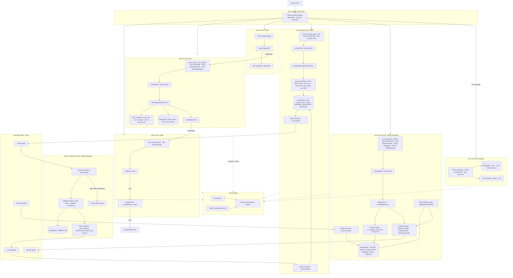
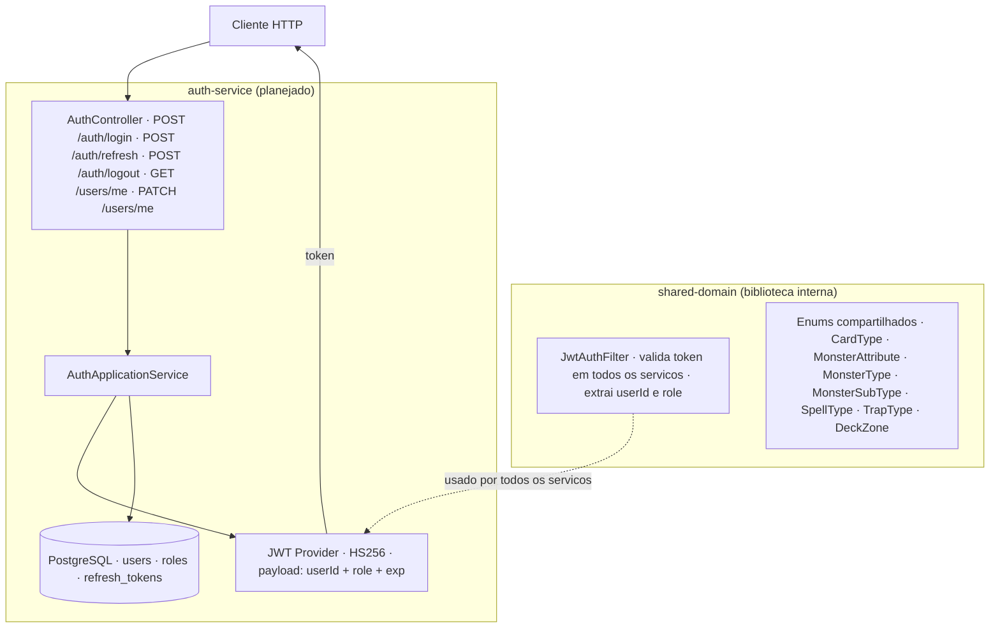
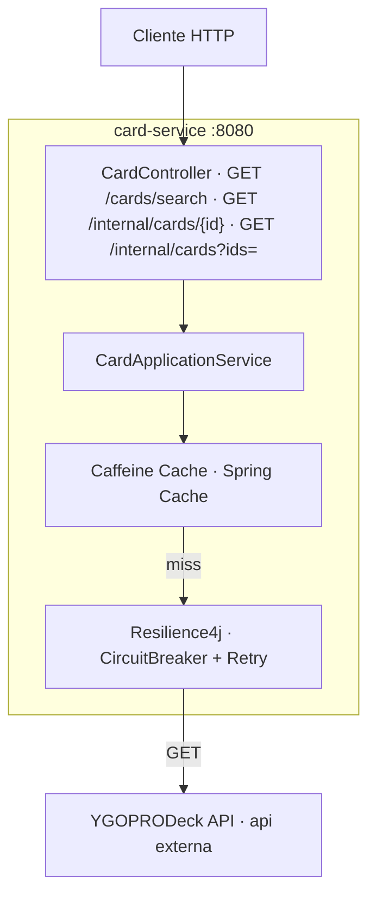
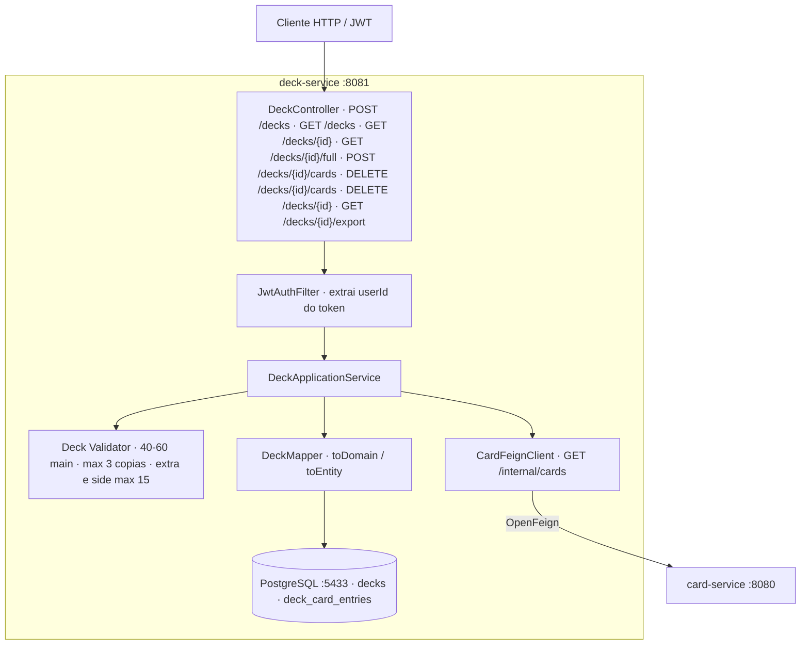
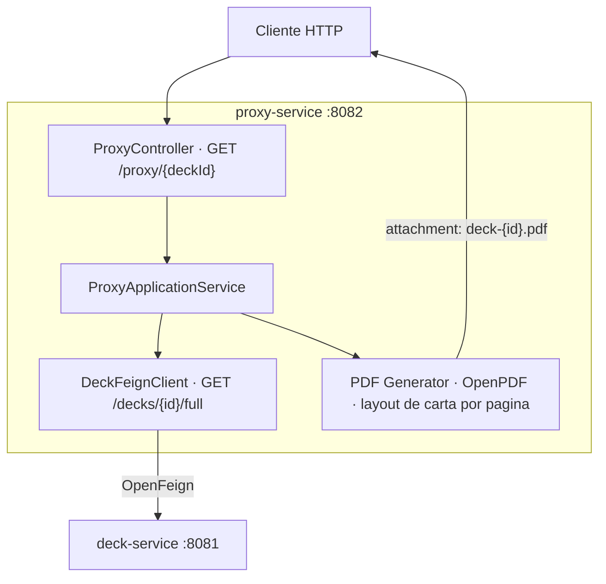
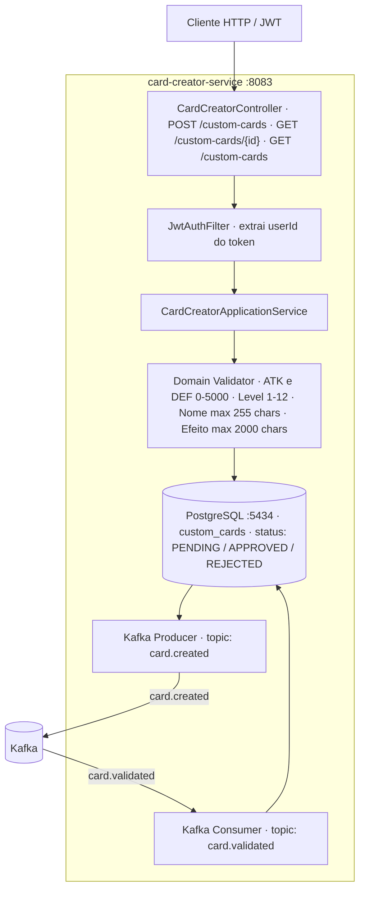
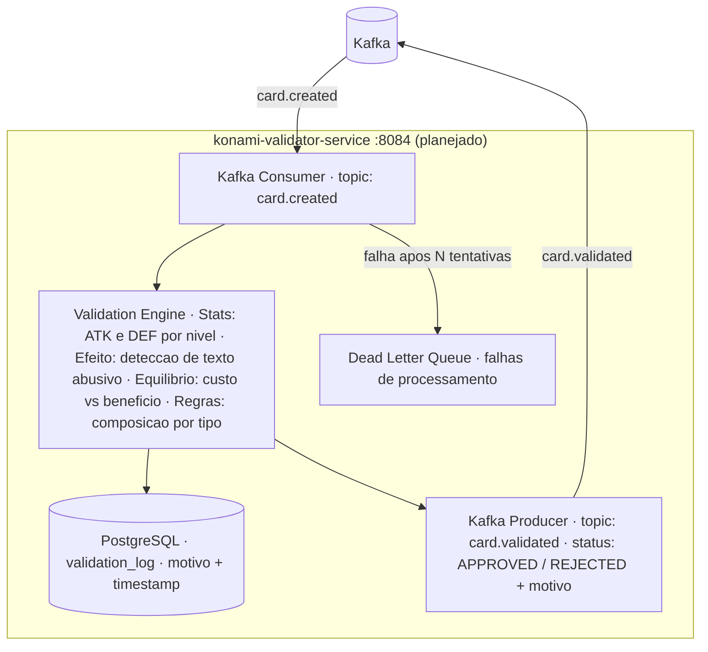
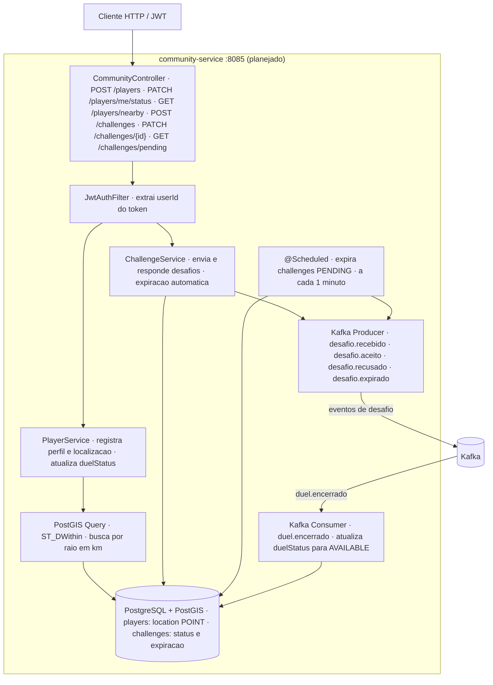

# Yu-Gi-Oh! Deck Management

Sistema de gerenciamento de coleções e decks de cartas Yu-Gi-Oh!, construído com arquitetura hexagonal em microserviços independentes que se comunicam via OpenFeign e Kafka.


---

## Visão Geral

O sistema é dividido em microserviços com responsabilidades bem delimitadas, organizados como monorepo Gradle. Cada serviço é independente, com seu próprio banco de dados e ciclo de deploy.

| Serviço | Porta | Status | Responsabilidade |
|---------|-------|--------|-----------------|
| **card-service** | 8080 | ✅ Desenvolvido | Consulta ao catálogo de cartas via YGOPRODeck API com cache |
| **deck-service** | 8081 | ✅ Desenvolvido | Criação e composição de decks com export/import .ydk |
| **proxy-service** | 8082 | ✅ Desenvolvido | Geração de PDFs de cartas para impressão de proxies |
| **card-creator-service** | 8083 | ✅ Desenvolvido | Criação de cartas customizadas com validação assíncrona |
| **konami-validator-service** | 8084 | 🔄 Planejado | Validação de balanceamento de cartas customizadas via Kafka |
| **community-service** | 8085 | 🔄 Planejado | Geolocalização de jogadores e sistema de desafio de duelo |
| **auth-service** | — | 🔄 Planejado | Autenticação e emissão de JWT |
| **shared-domain** | — | ✅ Desenvolvido | Biblioteca interna com enums e filtro JWT compartilhados |

---

## Arquitetura

O projeto segue a **Arquitetura Hexagonal (Ports & Adapters)**, isolando completamente o domínio de negócio de frameworks e infraestrutura. Cada serviço é estruturado em três camadas:

```
adapter/in/rest      ← Controllers (entrada HTTP)
application/service  ← Use Cases (orquestração)
domain/model         ← Entidades e Ports (núcleo isolado)
adapter/out/         ← Persistência, Feign, Kafka, API externa (saída)
```

---

## Fluxo Completo


```mermaid
graph TB
    Client["Cliente HTTP"]

    subgraph AUTH["auth-service (planejado)"]
        AuthAPI["POST /auth/login · POST /auth/refresh · GET /users/me"]
        AuthDB[("PostgreSQL: users · roles · refresh_tokens")]
        JwtProv["JWT Provider: userId + role"]
        AuthAPI --> AuthDB
        AuthAPI --> JwtProv
    end

    subgraph GATEWAY["API Gateway (planejado)"]
        GW["Spring Cloud Gateway: roteamento · rate limit · JWT filter"]
    end

    subgraph CARD["card-service :8080"]
        CardCtrl["GET /cards/search · GET /internal/cards"]
        CardCache["Caffeine Cache"]
        CardCB["Resilience4j: CircuitBreaker + Retry"]
        CardCtrl --> CardCache
        CardCache -->|miss| CardCB
    end

    subgraph DECK["deck-service :8081"]
        DeckCtrl["POST /decks · GET /decks · GET /decks/{id} · POST /decks/{id}/cards · GET /decks/{id}/export"]
        DeckJWT["JwtAuthFilter: extrai userId"]
        DeckSvc["DeckApplicationService"]
        DeckVal["Deck Validator: 40-60 main · max 3 copias · extra e side max 15"]
        DeckDB[("PostgreSQL :5433: decks · deck_card_entries")]
        DeckFeign["CardFeignClient"]
        DeckCtrl --> DeckJWT --> DeckSvc
        DeckSvc --> DeckVal
        DeckSvc --> DeckDB
        DeckSvc --> DeckFeign
    end

    subgraph PROXY["proxy-service :8082"]
        ProxyCtrl["GET /proxy/{deckId}"]
        ProxyPDF["PDF Generator: OpenPDF"]
        ProxyFeign["DeckFeignClient"]
        ProxyCtrl --> ProxyFeign
        ProxyFeign --> ProxyPDF
    end

    subgraph CREATOR["card-creator-service :8083"]
        CreatorCtrl["POST /custom-cards · GET /custom-cards/{id} · GET /custom-cards"]
        CreatorJWT["JwtAuthFilter: extrai userId"]
        CreatorSvc["CardCreatorApplicationService"]
        CreatorVal["Domain Validator: ATK e DEF 0-5000 · Level 1-12 · Nome max 255 · Efeito max 2000"]
        CreatorDB[("PostgreSQL :5434: custom_cards · status: PENDING / APPROVED / REJECTED")]
        CreatorPub["Kafka Producer: card.created"]
        CreatorSub["Kafka Consumer: card.validated"]
        CreatorCtrl --> CreatorJWT --> CreatorSvc
        CreatorSvc --> CreatorVal --> CreatorDB
        CreatorDB --> CreatorPub
        CreatorSub --> CreatorDB
    end

    subgraph VALIDATOR["konami-validator-service :8084 (planejado)"]
        ValSub["Kafka Consumer: card.created"]
        ValEngine["Validation Engine: stats · efeito · equilibrio · composicao"]
        ValDB[("PostgreSQL: validation_log")]
        ValPub["Kafka Producer: card.validated: APPROVED / REJECTED + motivo"]
        DLQ["Dead Letter Queue"]
        ValSub --> ValEngine
        ValEngine --> ValDB
        ValEngine --> ValPub
        ValSub -->|falha apos N tentativas| DLQ
    end

    subgraph COMMUNITY["community-service :8085 (planejado)"]
        CommCtrl["POST /players · PATCH /players/me/status · GET /players/nearby · POST /challenges · PATCH /challenges/{id}"]
        CommJWT["JwtAuthFilter: extrai userId"]
        CommSvc["PlayerService + ChallengeService"]
        CommGeo["PostGIS Query: ST_DWithin: busca por raio em km"]
        CommScheduler["@Scheduled: expira challenges PENDING"]
        CommDB[("PostgreSQL + PostGIS: players: location POINT · challenges: status · expiracao")]
        CommPub["Kafka Producer: desafio.recebido · desafio.aceito · desafio.expirado"]
        CommSub["Kafka Consumer: duel.encerrado"]
        CommCtrl --> CommJWT --> CommSvc
        CommSvc --> CommGeo --> CommDB
        CommSvc --> CommPub
        CommScheduler --> CommDB
        CommScheduler --> CommPub
        CommSub --> CommDB
    end

    subgraph BROKER["Message Broker: Kafka"]
        T1["card.created"]
        T2["card.validated"]
        T3["desafio.aceito"]
        T4["duel.encerrado"]
    end

    subgraph OBS["Observability"]
        Prom["Prometheus"]
        Graf["Grafana: dashboards · alertas"]
        Zipkin["Zipkin: distributed tracing"]
        Prom --> Graf
        Zipkin --> Graf
    end

    YGO["YGOPRODeck API"]

    Client --> GW
    GW --> CARD
    GW --> DECK
    GW --> PROXY
    GW --> CREATOR
    GW --> COMMUNITY
    GW -->|JWT validado| AUTH

    CardCB -->|GET| YGO
    DeckFeign -->|OpenFeign| CardCtrl
    ProxyFeign -->|OpenFeign| DeckCtrl
    CreatorPub --> T1 --> ValSub
    ValPub --> T2 --> CreatorSub
    CommPub --> T3
    T4 --> CommSub

    DECK -.->|metricas · traces| OBS
    CARD -.-> OBS
    CREATOR -.-> OBS
    VALIDATOR -.-> OBS
    COMMUNITY -.-> OBS
    AUTH -.-> OBS
```

---

## Diagramas por Serviço

### auth-service


```mermaid
graph TB
    Client["Cliente HTTP"]

    subgraph shared-domain["shared-domain (biblioteca interna)"]
        JwtFilter["JwtAuthFilter · valida token em todos os servicos · extrai userId e role"]
        SharedEnums["Enums compartilhados · CardType · MonsterAttribute · MonsterType · MonsterSubType · SpellType · TrapType · DeckZone"]
    end

    subgraph auth-service["auth-service (planejado)"]
        AuthController["AuthController · POST /auth/login · POST /auth/refresh · POST /auth/logout · GET /users/me · PATCH /users/me"]
        AuthService["AuthApplicationService"]
        JwtProvider["JWT Provider · HS256 · payload: userId + role + exp"]
        DB[("PostgreSQL · users · roles · refresh_tokens")]
        AuthController --> AuthService
        AuthService --> JwtProvider
        AuthService --> DB
    end

    Client --> AuthController
    JwtProvider -->|"token"| Client
    JwtFilter -.->|"usado por todos os servicos"| JwtProvider
```

### card-service


```mermaid
graph TB
    Client["Cliente HTTP"]

    subgraph card-service["card-service :8080"]
        Controller["CardController · GET /cards/search · GET /internal/cards/{id} · GET /internal/cards?ids="]
        Cache["Caffeine Cache · Spring Cache"]
        CB["Resilience4j · CircuitBreaker + Retry"]
        Service["CardApplicationService"]
        Controller --> Service
        Service --> Cache
        Cache -->|miss| CB
    end

    CB -->|GET| YGO["YGOPRODeck API · api externa"]
    Client --> Controller
```

### deck-service


```mermaid
graph TB
    Client["Cliente HTTP / JWT"]

    subgraph deck-service["deck-service :8081"]
        Controller["DeckController · POST /decks · GET /decks · GET /decks/{id} · GET /decks/{id}/full · POST /decks/{id}/cards · DELETE /decks/{id}/cards · DELETE /decks/{id} · GET /decks/{id}/export"]
        JWT["JwtAuthFilter · extrai userId do token"]
        Service["DeckApplicationService"]
        Validator["Deck Validator · 40-60 main · max 3 copias · extra e side max 15"]
        Mapper["DeckMapper · toDomain / toEntity"]
        DB[("PostgreSQL :5433 · decks · deck_card_entries")]
        Feign["CardFeignClient · GET /internal/cards"]
        Controller --> JWT
        JWT --> Service
        Service --> Validator
        Service --> Mapper
        Mapper --> DB
        Service --> Feign
    end

    Client --> Controller
    Feign -->|OpenFeign| CardService["card-service :8080"]
```

### proxy-service


```mermaid
graph TB
    Client["Cliente HTTP"]

    subgraph proxy-service["proxy-service :8082"]
        Controller["ProxyController · GET /proxy/{deckId}"]
        Service["ProxyApplicationService"]
        PDFGen["PDF Generator · OpenPDF · layout de carta por pagina"]
        Feign["DeckFeignClient · GET /decks/{id}/full"]
        Controller --> Service
        Service --> Feign
        Service --> PDFGen
    end

    Client --> Controller
    Feign -->|OpenFeign| DeckService["deck-service :8081"]
    PDFGen -->|"attachment: deck-{id}.pdf"| Client
```

### card-creator-service


```mermaid
graph TB
    Client["Cliente HTTP / JWT"]

    subgraph card-creator-service["card-creator-service :8083"]
        Controller["CardCreatorController · POST /custom-cards · GET /custom-cards/{id} · GET /custom-cards"]
        JWT["JwtAuthFilter · extrai userId do token"]
        Service["CardCreatorApplicationService"]
        DomainVal["Domain Validator · ATK e DEF 0-5000 · Level 1-12 · Nome max 255 chars · Efeito max 2000 chars"]
        DB[("PostgreSQL :5434 · custom_cards · status: PENDING / APPROVED / REJECTED")]
        Publisher["Kafka Producer · topic: card.created"]
        Consumer["Kafka Consumer · topic: card.validated"]
        Controller --> JWT
        JWT --> Service
        Service --> DomainVal
        DomainVal --> DB
        DB --> Publisher
        Consumer --> DB
    end

    Client --> Controller
    Publisher -->|"card.created"| Kafka[("Kafka")]
    Kafka -->|"card.validated"| Consumer
```

### konami-validator-service


```mermaid
graph TB
    Kafka[("Kafka")]

    subgraph konami-validator-service["konami-validator-service :8084 (planejado)"]
        Consumer["Kafka Consumer · topic: card.created"]
        Engine["Validation Engine · Stats: ATK e DEF por nivel · Efeito: deteccao de texto abusivo · Equilibrio: custo vs beneficio · Regras: composicao por tipo"]
        DB[("PostgreSQL · validation_log · motivo + timestamp")]
        Publisher["Kafka Producer · topic: card.validated · status: APPROVED / REJECTED + motivo"]
        DLQ["Dead Letter Queue · falhas de processamento"]
        Consumer --> Engine
        Engine --> DB
        Engine --> Publisher
        Consumer -->|"falha apos N tentativas"| DLQ
    end

    Kafka -->|"card.created"| Consumer
    Publisher -->|"card.validated"| Kafka
```

### community-service


```mermaid
graph TB
    Client["Cliente HTTP / JWT"]
    Kafka[("Kafka")]

    subgraph community-service["community-service :8085 (planejado)"]
        Controller["CommunityController · POST /players · PATCH /players/me/status · GET /players/nearby · POST /challenges · PATCH /challenges/{id} · GET /challenges/pending"]
        JWT["JwtAuthFilter · extrai userId do token"]
        PlayerService["PlayerService · registra perfil e localizacao · atualiza duelStatus"]
        ChallengeService["ChallengeService · envia e responde desafios · expiracao automatica"]
        GeoQuery["PostGIS Query · ST_DWithin · busca por raio em km"]
        Scheduler["@Scheduled · expira challenges PENDING · a cada 1 minuto"]
        DB[("PostgreSQL + PostGIS · players: location POINT · challenges: status e expiracao")]
        Publisher["Kafka Producer · desafio.recebido · desafio.aceito · desafio.recusado · desafio.expirado"]
        Consumer["Kafka Consumer · duel.encerrado · atualiza duelStatus para AVAILABLE"]
        Controller --> JWT
        JWT --> PlayerService
        JWT --> ChallengeService
        PlayerService --> GeoQuery
        GeoQuery --> DB
        ChallengeService --> DB
        ChallengeService --> Publisher
        Scheduler --> DB
        Scheduler --> Publisher
        Consumer --> DB
    end

    Client --> Controller
    Publisher -->|eventos de desafio| Kafka
    Kafka -->|"duel.encerrado"| Consumer
```

---

## Shared Domain

O `shared-domain` é um módulo Java puro — sem Spring, sem banco, sem dependências externas — que contém os enums e o `JwtAuthFilter` compartilhados entre os serviços. Garante consistência sem duplicação de código e sem acoplamento de runtime.

| Enum | Valores |
|------|---------|
| `CardType` | MONSTER, SPELL, TRAP |
| `MonsterAttribute` | DARK, LIGHT, FIRE, WATER, EARTH, WIND, DIVINE |
| `MonsterType` | DRAGON, WARRIOR, SPELLCASTER, FIEND e outros 19 tipos |
| `MonsterSubType` | NORMAL, EFFECT, FUSION, SYNCHRO, XYZ, LINK e outros |
| `SpellType` | NORMAL, CONTINUOUS, QUICK_PLAY, FIELD, EQUIP, RITUAL |
| `TrapType` | NORMAL, CONTINUOUS, COUNTER |
| `DeckZone` | MAIN, EXTRA, SIDE |

---

## Stack

| Camada | Tecnologia |
|--------|-----------|
| Linguagem | Java 17 |
| Framework | Spring Boot 3.1.9 |
| Build | Gradle 7.5 (monorepo multi-módulo) |
| Comunicação entre serviços | Spring Cloud OpenFeign |
| Mensageria | Apache Kafka |
| Resiliência | Resilience4j (CircuitBreaker + Retry) |
| Cache | Caffeine (Spring Cache) |
| Persistência | Spring Data JPA + Flyway |
| Banco de dados | PostgreSQL |
| Geolocalização | PostGIS (ST_DWithin) |
| Busca full-text | Elasticsearch (planejado) |
| Geração de PDF | OpenPDF |
| Segurança | Spring Security + JWT |
| Mapeamento | Lombok |
| Containers | Docker + Docker Compose |
| CI | GitHub Actions |

---

## Como Executar

### Pré-requisitos

- Java 17+
- Docker e Docker Compose

### Subir a infraestrutura

```bash
docker compose up -d
```

Isso sobe PostgreSQL (deck-service na porta 5433, card-creator-service na porta 5434), Zookeeper e Kafka.

### Buildar o projeto

```bash
./gradlew :shared-domain:build
./gradlew :card-service:bootRun
./gradlew :deck-service:bootRun
./gradlew :card-creator-service:bootRun
./gradlew :proxy-service:bootRun
```

---

## Endpoints Principais

### card-service (8080)

| Método | Endpoint | Descrição |
|--------|----------|-----------|
| `GET` | `/cards/search?name=&fname=&type=&page=&size=` | Busca cartas com filtros via YGOPRODeck |
| `GET` | `/internal/cards/{id}` | Busca carta por ID (uso interno) |
| `GET` | `/internal/cards?ids=` | Busca múltiplas cartas por IDs (uso interno) |

### deck-service (8081)

| Método | Endpoint | Descrição |
|--------|----------|-----------|
| `POST` | `/decks` | Cria um novo deck |
| `GET` | `/decks` | Lista decks do usuário autenticado |
| `GET` | `/decks/{deckId}` | Busca deck por ID |
| `GET` | `/decks/{deckId}/full` | Retorna deck com dados completos das cartas |
| `POST` | `/decks/{deckId}/cards` | Adiciona carta ao deck |
| `DELETE` | `/decks/{deckId}/cards` | Remove carta do deck |
| `DELETE` | `/decks/{deckId}` | Remove deck |
| `GET` | `/decks/{deckId}/export` | Exporta deck no formato `.ydk` |

### card-creator-service (8083)

| Método | Endpoint | Descrição |
|--------|----------|-----------|
| `POST` | `/custom-cards` | Cria carta customizada |
| `GET` | `/custom-cards/{id}` | Consulta carta e status de validação |
| `GET` | `/custom-cards` | Lista cartas do usuário |

### proxy-service (8082)

| Método | Endpoint | Descrição |
|--------|----------|-----------|
| `GET` | `/proxy/{deckId}` | Gera PDF com imagens das cartas do deck para impressão |

### community-service (8085)

| Método | Endpoint | Descrição |
|--------|----------|-----------|
| `POST` | `/players` | Registra ou atualiza perfil e localização |
| `PATCH` | `/players/me/status` | Atualiza disponibilidade para duelo |
| `GET` | `/players/nearby?lat=&lng=&radiusKm=&status=` | Jogadores próximos com filtro de status |
| `POST` | `/challenges` | Envia desafio de duelo para jogador próximo |
| `PATCH` | `/challenges/{id}` | Aceita ou recusa desafio |
| `GET` | `/challenges/pending` | Lista desafios recebidos aguardando resposta |

---

## Regras de Criação de Cartas Customizadas

As validações vivem no domínio — é impossível criar uma `CustomCard` inválida independente de onde for instanciada.

- ATK e DEF entre 0 e 5000
- Level entre 1 e 12
- Nome máximo de 255 caracteres
- Descrição/efeito máximo de 2000 caracteres
- Atributo, tipo e subtipo obrigatórios conforme o tipo da carta

---

## Segurança

Todos os endpoints são protegidos via JWT. O token carrega `userId` e `role`, propagados pelo `JwtAuthFilter` do `shared-domain`. Cada serviço valida o token de forma independente — não há chamada ao `auth-service` a cada requisição.

O `deck-service` garante isolamento por usuário: todas as queries filtram por `ownerId` extraído do token, tornando impossível acessar ou modificar decks de outro usuário mesmo conhecendo o ID.

---

## Próximos Passos

- [ ] `konami-validator-service` — validação de balanceamento via regras configuráveis
- [ ] `community-service` — geolocalização com PostGIS e sistema de desafio de duelo
- [ ] `auth-service` — especificamente: autenticação centralizada com refresh token e logout
- [ ] Elasticsearch — busca full-text de cartas por descrição de efeito
- [ ] Validação de regras de deck (40-60 main, máximo 15 extra/side, máximo 3 cópias)
- [ ] Import de deck via arquivo `.ydk`
- [ ] Testes unitários e de integração com Testcontainers
- [ ] `duel-service` (repo separado) — motor de duelo integrado ao ocgcore (C++ + Lua)

---

## Autor

**Pedro (odevpedro)**
[GitHub](https://github.com/odevpedro) · [dev.to](https://dev.to/odevpedro) · [Blog](http://odevpedro.bearblog.dev)
