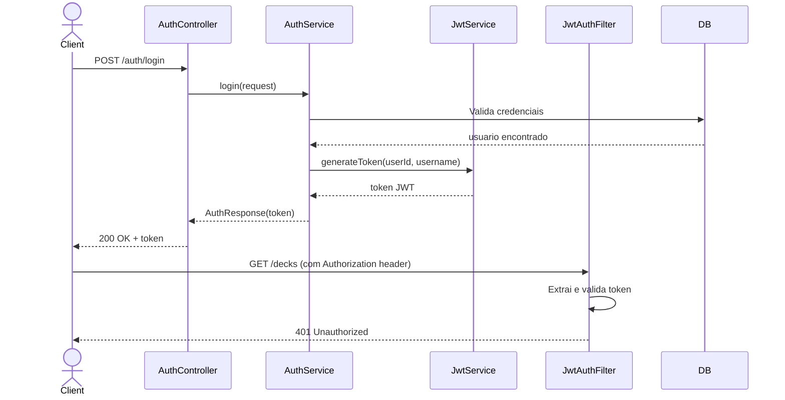
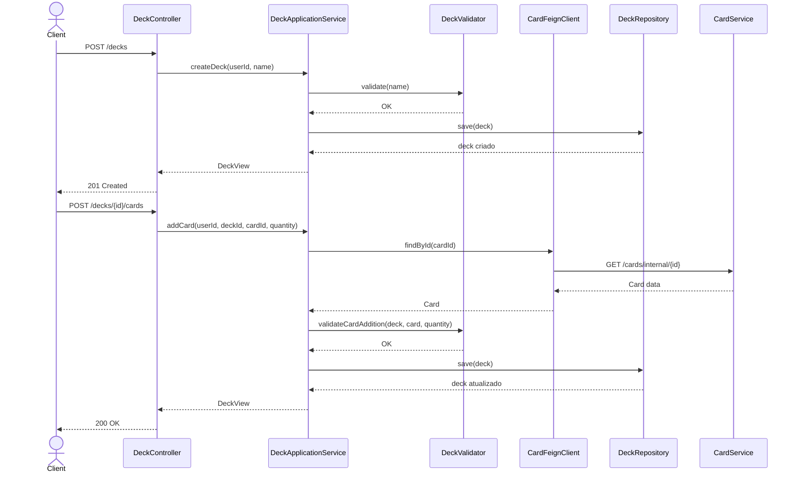
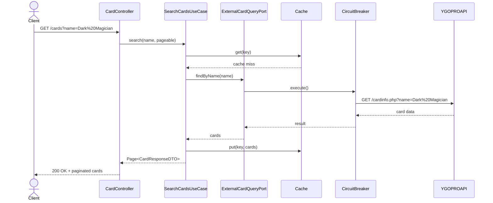
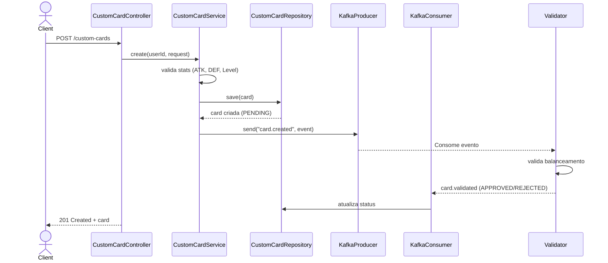
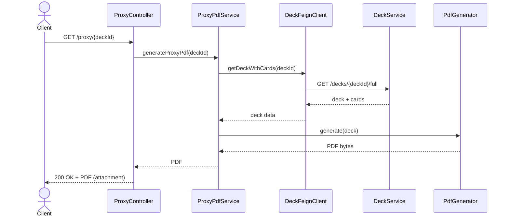
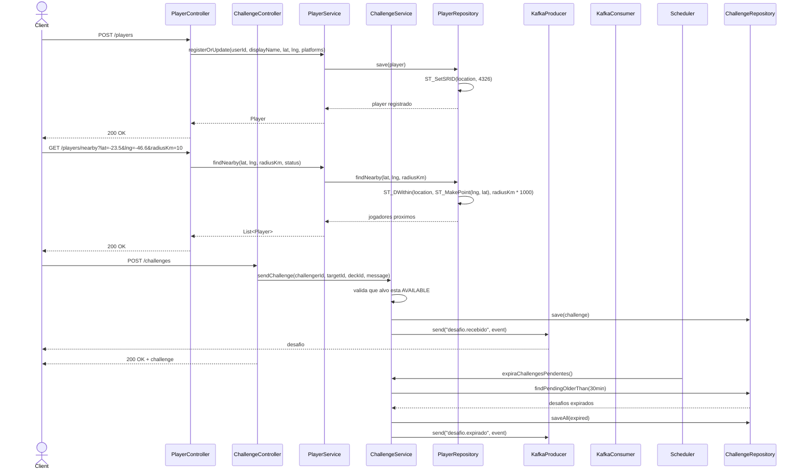

# System Feature Flows

> Registro historico e incremental dos fluxos internos de cada funcionalidade.
> Este documento cresce a cada nova feature implementada e **nunca tem secoes removidas**.

---

## Indice

<!-- Atualize este indice a cada nova feature adicionada -->

- [Visao Geral da Arquitetura](#visao-geral-da-arquitetura)
- [Convencoes deste Documento](#convencoes-deste-documento)
- [ApiRoutes — Centralizacao de Rotas](#apiroutes--centralizacao-de-rotas)
- [Feature: Autenticacao JWT](#feature-autenticacao-jwt)
- [Feature: Gerenciamento de Decks](#feature-gerenciamento-de-decks)
- [Feature: Busca de Cartas](#feature-busca-de-cartas)
- [Feature: Criacao de Cartas Customizadas](#feature-criacao-de-cartas-customizadas)
- [Feature: Geracao de Proxy PDF](#feature-geracao-de-proxy-pdf)
- [Feature: Comunidade e Desafios](#feature-comunidade-e-desafios)

---

## Visao Geral da Arquitetura

> Descreva aqui a arquitetura geral do sistema — uma vez, no topo. As features abaixo assumem esse contexto.

**Padrao arquitetural:** Hexagonal (Ports & Adapters)

**Fluxo global de uma requisicao:**

```
HTTP Request
    └── Controller (adapter/in/rest)
            └── Use Case (application/service)
                    ├── Domain Entity / Domain Service
                    └── Repository / Gateway (adapter/out/)
                              └── Database / API Externa
```

**Microservicos e responsabilidades:**

| Servico | Porta | Responsabilidade |
|---------|-------|-----------------|
| card-service | 8080 | Consulta ao catalogo de cartas via YGOPRODeck API com cache |
| deck-service | 8081 | Criacao e composicao de decks com export/import .ydk |
| proxy-service | 8082 | Geracao de PDFs de cartas para impressao de proxies |
| card-creator-service | 8083 | Criacao de cartas customizadas com validacao assincrona |
| community-service | 8085 | Geolocalizacao de jogadores e sistema de desafio de duelo |
| auth-service | 8086 | Autenticacao e emissao de JWT |
| shared-domain | — | Biblioteca interna com enums e filtro JWT compartilhados |

**Camadas e responsabilidades:**

| Camada | Responsabilidade |
|--------|-----------------|
| `adapter/in/rest` | Receber requisicoes HTTP, validar DTOs, formatar resposta |
| `application/service` | Orquestrar o caso de uso, coordenar dominio e infra |
| `domain/model` | Regras de negocio puras, entidades, value objects |
| `adapter/out/` | Persistencia, Feign, Kafka, API externa |

---

## Convencoes deste Documento

- **Rotas centralizadas** via `ApiRoutes` em `shared-domain/src/main/java/com/odevpedro/yugiohcollections/shared/constants/ApiRoutes.java`
- **Erros de dominio** sao lancados como excecoes tipadas
- **Erros de infra** sao capturados e relancados como erros de aplicacao
- **Transacoes de banco** sao gerenciadas no nivel do service, nao do repository
- **DTOs** trafegam entre presentation ↔ application; **Entidades** entre application ↔ domain

---
---

# ApiRoutes — Centralizacao de Rotas

> **Versao:** 1.0.0
> **Implementada em:** 2026-04-28
> **Status:** Concluida

---

## Resumo

Todas as rotas da aplicacao foram centralizadas na classe `ApiRoutes` do modulo `shared-domain`, permitindo manutencao unificada e evitando inconsistencias entre controllers.

**Motivacao:** Rotas hardcoded nos controllers causavam duplicacao e risco de不一致.
**Resultado:** Todas as rotas agora referenciam constantes de `ApiRoutes`.

---

## Rotas Definidas

### Auth

```java
public static final String AUTH_BASE = "/auth";
public static final String AUTH_REGISTER = AUTH_BASE + "/register";
public static final String AUTH_LOGIN = AUTH_BASE + "/login";
public static final String AUTH_ME = AUTH_BASE + "/me";
```

### Decks

```java
public static final String DECKS_BASE = "/decks";
public static final String DECKS_BY_ID = DECKS_BASE + ID;
public static final String DECKS_FULL = "/decks/{deckId}/full";
public static final String DECKS_CARDS = "/decks/{deckId}/cards";
public static final String DECKS_EXPORT = "/decks/{deckId}/export";
```

### Cards

```java
public static final String CARDS_BASE = "/cards";
public static final String CARDS_INTERNAL = "/internal";
public static final String CARDS_INTERNAL_BY_ID = CARDS_INTERNAL + ID;
```

### Custom Cards

```java
public static final String CUSTOM_CARDS_BASE = "/custom-cards";
public static final String CUSTOM_CARDS_BY_ID = CUSTOM_CARDS_BASE + ID;
```

### Players

```java
public static final String PLAYERS_BASE = "/players";
public static final String PLAYERS_ME_STATUS = PLAYERS_BASE + "/me/status";
public static final String PLAYERS_NEARBY = PLAYERS_BASE + "/nearby";
```

### Challenges

```java
public static final String CHALLENGES_BASE = "/challenges";
public static final String CHALLENGES_BY_ID = CHALLENGES_BASE + ID;
public static final String CHALLENGES_PENDING = CHALLENGES_BASE + "/pending";
```

### Proxy

```java
public static final String PROXY_BASE = "/proxy";
public static final String PROXY_BY_ID = PROXY_BASE + ID;
```

---

## Arquivos Modificados

| Arquivo | Mudanca |
|---------|--------|
| `shared-domain/.../constants/ApiRoutes.java` | Adicionadas todas as constantes de rota |
| `auth-service/.../AuthController.java` | `@RequestMapping(ApiRoutes.AUTH_BASE)` |
| `deck-service/.../DeckController.java` | `@RequestMapping(ApiRoutes.DECKS_BASE)` |
| `player-service/.../PlayerController.java` | `@RequestMapping(ApiRoutes.PLAYERS_BASE)` |
| `challenge-service/.../ChallengeController.java` | `@RequestMapping(ApiRoutes.CHALLENGES_BASE)` |
| `proxy-service/.../ProxyController.java` | `@RequestMapping(ApiRoutes.PROXY_BASE)` |

---
---

# Feature: Autenticacao JWT

> **Versao:** 1.0.0
> **Implementada em:** 2024
> **Status:** Concluida

---

## Resumo

Sistema de autenticacao que emite e valida tokens JWT para autenticacao dos servicos. O token carrega `userId` e `role`, propagados pelo `JwtAuthFilter` do `shared-domain`.

**Motivacao:** Cada servico precisa validar tokens de forma independente.
**Resultado:** Autenticacao stateless via JWT, sem chamada ao auth-service a cada requisicao.

---

## Fluxo Principal

### 1. Ponto de Entrada

- **Tipo:** HTTP REST
- **Arquivo:** `auth-service/src/main/java/com/odevpedro/yugiohcollections/auth/adapter/in/rest/AuthController.java`
- **Rotas:** `POST /auth/register`, `POST /auth/login`, `GET /auth/me`
- **Autenticacao:** Publica

---

## Diagrama de Sequencia



---
---

# Feature: Gerenciamento de Decks

> **Versao:** 1.0.0
> **Implementada em:** 2024
> **Status:** Concluida

---

## Resumo

CRUD completo de decks de cartas Yu-Gi-Oh! com validacao de regras do jogo (40-60 cartas no main deck, max 15 no extra/side, max 3 copias de cada carta).

**Motivacao:** Necessidade de gerenciar colecoes pessoais de decks.
**Resultado:** API REST para criar, editar, buscar e exportar decks no formato .ydk.

---

## Fluxo Principal

### 1. Ponto de Entrada

- **Tipo:** HTTP REST
- **Arquivo:** `deck-service/src/main/java/com/odevpedro/yugiohcollections/deck/adapter/in/rest/DeckController.java`
- **Rotas:** `POST /decks`, `GET /decks`, `GET /decks/{deckId}`, `GET /decks/{deckId}/full`, `POST /decks/{deckId}/cards`, `DELETE /decks/{deckId}/cards`, `DELETE /decks/{deckId}`, `GET /decks/{deckId}/export`
- **Autenticacao:** JWT obrigatorio

### 2. Validação de Entrada

| Campo | Tipo | Obrigatorio | Regra de validacao |
|-------|------|-------------|---------------------|
| name | String | Sim | Nao vazio, max 100 caracteres |

### 3. Regras de Negocio

| Regra | Descricao | Localizacao no Codigo |
|-------|-----------|----------------------|
| Main deck size | 40-60 cartas | `DeckValidator` |
| Extra deck size | 0-15 cartas | `DeckValidator` |
| Side deck size | 0-15 cartas | `DeckValidator` |
| Max copies | Max 3 copias de cada carta | `DeckValidator` |
| Isolation | Queries filtradas por ownerId | `DeckRepository` |

### 4. Integracoes

| Servico | Operacao | Timeout | Retry |
|---------|----------|---------|-------|
| card-service | GET /cards/internal/{id} via Feign | 5s | 3 |

### 5. Resposta Final

```json
{
  "id": 1,
  "name": "Meu Deck",
  "ownerId": "user-123",
  "mainDeckSize": 40,
  "extraDeckSize": 10,
  "sideDeckSize": 15
}
```

---

## Diagrama de Sequencia



---
---

# Feature: Busca de Cartas

> **Versao:** 1.0.0
> **Implementada em:** 2024
> **Status:** Concluida

---

## Resumo

Busca de cartas do catalogo oficial Yu-Gi-Oh! via YGOPRODeck API, com cache em memoria e circuit breaker para resiliencia.

**Motivacao:** Necessidade de buscar cartas oficiais para adicionar aos decks.
**Resultado:** API REST com busca por nome, tipo e descricao, cache inteligente e resiliencia.

---

## Fluxo Principal

### 1. Ponto de Entrada

- **Tipo:** HTTP REST
- **Arquivo:** `card-service/src/main/java/com/odevpedro/yugiohcollections/card/adapter/in/rest/CardController.java`
- **Rotas:** `GET /cards` (busca paginada), `GET /cards/internal/{id}`, `GET /cards/internal?ids=`
- **Autenticacao:** `/cards` publica, `/cards/internal` requer token

### 3. Regras de Negocio

| Regra | Descricao | Localizacao no Codigo |
|-------|-----------|----------------------|
| Cache | Resultados em cache por 1 hora | `CacheConfig` |
| Circuit Breaker | Abre circuito apos 5 falhas | `Resilience4jConfig` |
| Retry | 3 tentativas com backoff | `Resilience4jConfig` |

### 4. Integracoes

| Servico | Operacao | Timeout | Retry |
|---------|----------|---------|-------|
| YGOPRODeck API | GET /cardinfo.php | 10s | 3 |

---

## Diagrama de Sequencia



---
---

# Feature: Criacao de Cartas Customizadas

> **Versao:** 1.0.0
> **Implementada em:** 2024
> **Status:** Concluida

---

## Resumo

Sistema de criacao de cartas customizadas com validacao de regras do jogo, publicacao de eventos via Kafka para validacao assincrona.

**Motivacao:** Jogadores queriam criar cartas personalizadas.
**Resultado:** API REST para criar cartas com validacao automatica de stats e publicacao para validacao por IA.

---

## Fluxo Principal

### 1. Ponto de Entrada

- **Tipo:** HTTP REST
- **Arquivo:** `card-creator-service/src/main/java/com/odevpedro/yugiohcollections/creator/adapter/in/rest/CustomCardController.java`
- **Rotas:** `POST /custom-cards`, `GET /custom-cards/{id}`, `GET /custom-cards`
- **Autenticacao:** JWT obrigatorio

### 3. Regras de Negocio

| Regra | Descricao | Localizacao no Codigo |
|-------|-----------|----------------------|
| ATK/DEF | Entre 0 e 5000 | `CustomCard` |
| Level | Entre 1 e 12 | `CustomCard` |
| Nome | Max 255 caracteres | `CustomCard` |
| Efeito | Max 2000 caracteres | `CustomCard` |

### 4. Integracoes

| Servico | Operacao | Topico |
|---------|----------|--------|
| Kafka | Producer | `card.created` |
| Kafka | Consumer | `card.validated` |

---

## Diagrama de Sequencia



---
---

# Feature: Geracao de Proxy PDF

> **Versao:** 1.0.0
> **Implementada em:** 2024
> **Status:** Concluida

---

## Resumo

Geracao de PDF com imagens das cartas do deck para impressao de proxies em torneios.

**Motivacao:** Jogadores precisam de proxies impressos para cartas que nao tem.
**Resultado:** API REST que gera PDF com layout de carta por pagina.

---

## Fluxo Principal

### 1. Ponto de Entrada

- **Tipo:** HTTP REST
- **Arquivo:** `proxy-service/src/main/java/com/odevpedro/yugiohcollections/proxy/adapter/in/rest/ProxyController.java`
- **Rota:** `GET /proxy/{deckId}`
- **Autenticacao:** JWT obrigatorio

### 4. Integracoes

| Servico | Operacao | Timeout |
|---------|----------|---------|
| deck-service | GET /decks/{deckId}/full via Feign | 30s |

---

## Diagrama de Sequencia



---
---

# Feature: Comunidade e Desafios

> **Versao:** 1.0.0
> **Implementada em:** 2024
> **Status:** Concluida

---

## Resumo

Sistema de geolocalizacao de jogadores e desafios de duelo, usando PostGIS para busca por raio e Kafka para notificacoes.

**Motivacao:** Jogadores queriam encontrar oponentes cercanos para duelar.
**Resultado:** API REST para registro de jogadores, busca por proximidade e sistema de desafios.

---

## Fluxo Principal

### 1. Ponto de Entrada

- **Tipo:** HTTP REST
- **Arquivos:**
  - `community-service/.../PlayerController.java`
  - `community-service/.../ChallengeController.java`
- **Rotas Players:** `POST /players`, `PATCH /players/me/status`, `GET /players/nearby`
- **Rotas Challenges:** `POST /challenges`, `PATCH /challenges/{id}`, `GET /challenges/pending`
- **Autenticacao:** JWT obrigatorio

### 3. Regras de Negocio

| Regra | Descricao | Localizacao no Codigo |
|-------|-----------|----------------------|
| Busca por raio | PostGIS ST_DWithin | `PlayerRepository` |
| Expiracao | Desafios pendentes expiram em 30 min | `@Scheduled` |
| Status | AVAILABLE, BUSY, OFFLINE | `DuelStatus` |

### 4. Integracoes

| Servico | Operacao | Topico |
|---------|----------|--------|
| Kafka | Producer | `desafio.recebido`, `desafio.aceito`, `desafio.expirado` |
| Kafka | Consumer | `duel.encerrado` |

---

## Diagrama de Sequencia



---
---

## Historico

| Data | Mudanca |
|------|---------|
| 2026-04-28 | Adicionada documentacao de ApiRoutes — centralizacao de rotas |
| 2024 | Criacao do documento com todas as features |